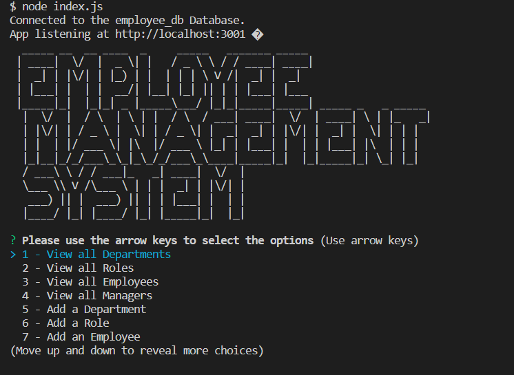
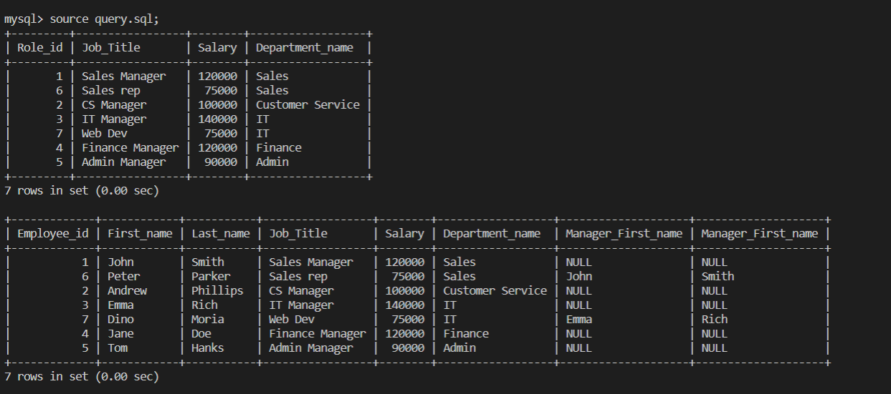

# Employee-Tracker---CMS

## 

# Functionality of this app 
* A Node command-line application that predominantly uses the inquirer package that takes information about department, employee or title and update or delete information based on users requirement which is also linked with database connected with server. It is an interfaces that allow non-developers to easily view and interact with information stored in databases.

# Installation

* Download or clone repository.
* Node.js is required to run the application
* npm install to install the required packages as per package.json 

# Usage

* To start using the application, use node.js command line and follow the prompts
* The application will run with node index.js command

# Demo of application 
[Video Demo](https://drive.google.com/file/d/1o89v-cRlD8KS--AUCVKTTxsp6Skl-TLT/view)

# Below are the sample pages of command line application

# Features and Techonlogies uses
* JavaScript
* Node.js
* Express.js
* inquirer
* mysql2

## Under the MIT license 

